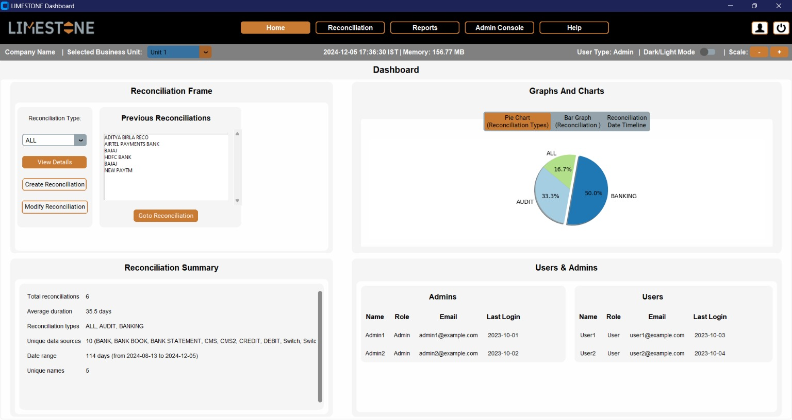
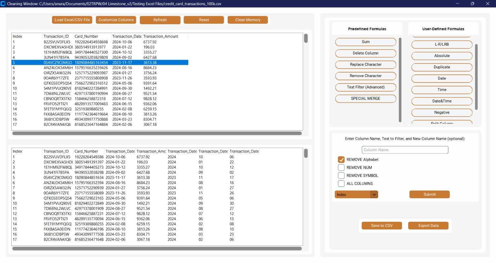
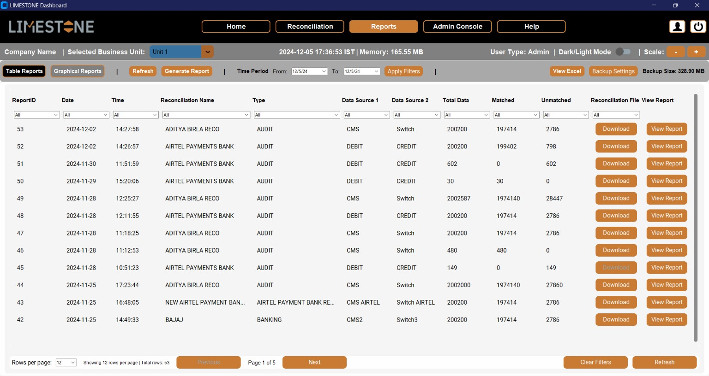
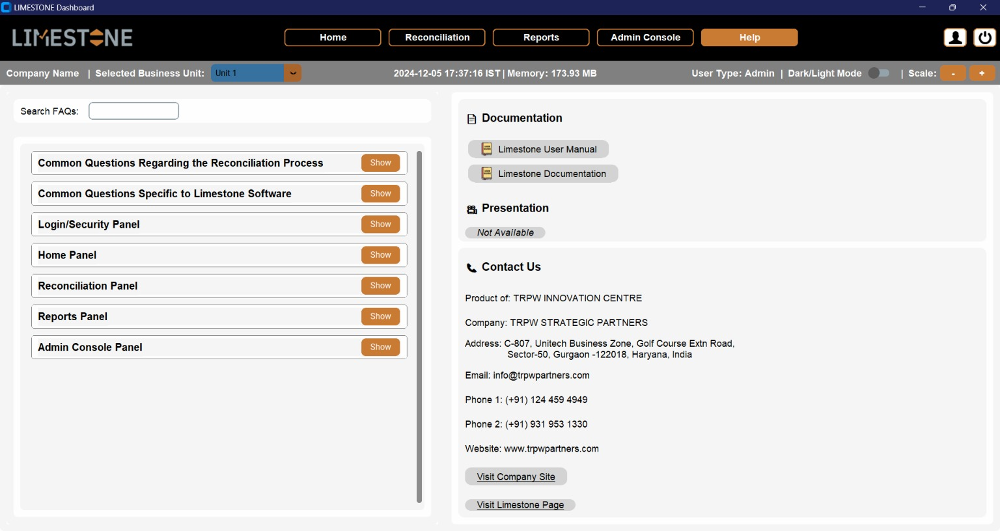

# **Limestone Reconciliation Software**  
_A robust, Python-powered reconciliation software with advanced data cleaning, merging, and reporting capabilities._

---

## **About Limestone Reconciliation Software**  
Limestone Reconciliation Software simplifies the reconciliation process with its feature-rich design, modern UI, and user-centric functionality. Built using **Python** and **CustomTkinter**, it supports multi-scenario reconciliations for registered companies, offering unmatched flexibility, automation, and insight.

### **Core Features**
- **Dynamic Dashboard**: Real-time widgets and graphical charts.
- **Advanced Data Cleaning**: Predefined and user-defined formulas for handling complex datasets.
- **Layered Reconciliation**: Multi-layered matching with exportable files at each stage.
- **Flexible Reporting**: Interactive, graphical reports with backup management.

---

## **Screenshots**

### **1. Home Panel**  
The **Home Panel** serves as the central hub for users, featuring an intuitive dashboard with widgets for key metrics and graphical insights.



---

### **2. Reconciliation Panel**  
Manage reconciliation processes with ease. Create scenarios under reconciliation types and business units, upload multiple data sources, and merge them dynamically for analysis.


---

### **3. Cleaning Window**  
A dedicated cleaning window allows users to clean and prepare data with powerful tools:
- **Predefined Formulas**: Sum, Delete Column, Text Filters (Regex), Special Merge, and more.
- **User-Defined Formulas**: Math Operations, Splitting, Concatenation, and Date-Time handling.  
Special merge handles split transactions effectively.



---

### **4. Reports Panel**  
The **Reports Panel** offers advanced reporting capabilities, including:
- Backup management (manual/auto deletion).
- Graphical analysis of reconciliation layers.
- Sorting and filtering options for better monitoring.  



---

### **5. About Panel**  
This section provides details about the company, documentation, contact information, and FAQs for user support.



---

## **Skills Inferred from Python Libraries**

This repository reflects expertise in the following areas based on the listed Python libraries:

### **Core Skills**
- **Python Programming**: Proficient in building scalable and maintainable applications.
- **Data Analysis & Manipulation**: Expertise in libraries like Pandas, NumPy, and Dask.
- **Data Visualization**: Creating insightful visualizations using Matplotlib and Bokeh.
- **Web Development & API Integration**: Skilled in REST APIs, Google APIs, and OAuth2 authentication.
- **File Handling**: Working with Excel (`openpyxl`, `XlsxWriter`), XML, and PDF files.

### **Specialized Skills**
- **GUI Development**: Building interactive applications with CustomTkinter, CTkComponents, and Tkcalendar.
- **Text Processing**: Utilizing Babel, Levenshtein, and Markdown libraries.
- **Distributed Computing**: Leveraging Dask for scalable computations.

### **System & Performance**
- **Profiling and Monitoring**: Using tools like `memory-profiler` and `psutil`.
- **Windows-Specific Tools**: Experience with Pywin32-ctypes and Pywinstyles.

### **Security & Authentication**
- RSA encryption and OAuth2 client integrations.

### **Additional Skills**
- Packaging and distribution with PyInstaller and setuptools.
- Internationalization and localization using Babel.

---

## **Installation**
1. Clone the repository:  
   ```bash
   git clone https://github.com/your-repo/limestone-reconciliation.git
   ```
2. Navigate to the directory:  
   ```bash
   cd limestone-reconciliation
   ```
3. Install dependencies:  
   ```bash
   pip install -r requirements.txt
   ```
4. Run the application:  
   ```bash
   python main.py
   ```

---

## **License**
This project is licensed under the [MIT License](LICENSE).  

---

Contributions are welcome! Feel free to open issues or submit pull requests. For questions, contact us at [support@example.com](mailto:support@example.com).  
